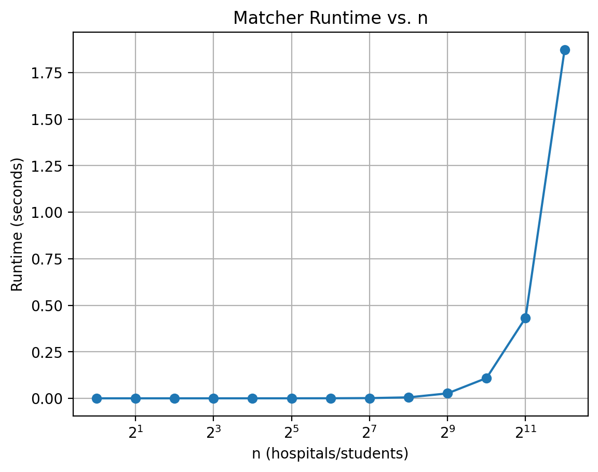
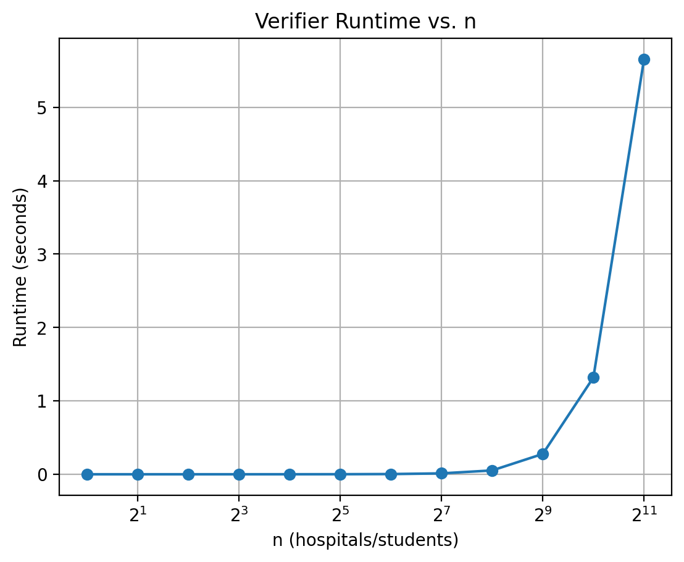

# Programming Assignment 1 - Matching and Verifying

## Overview
Programming Assignment 1 implements the hospital-proposing Gale-Shapley algorithm for the hospital-student stable matching problem (Task A), and a verifier that checks whether a proposed matching is valid and stable (Task B). It also includes a plan for scalability testing and graphs for runtime (Task C).

## Students
- Student 1: Brock Gilman - UFID: 58803474
- Student 2: Kyle Scarmack - UFID: 20823723

## Repository Structure
- `src/matcher.py` - Gale-Shapley matching engine (hospital-proposing)
- `src/verifier.py` - Validity and stability checker
- `src/scalability.py` - Measures running time of each algorithm (matcher and verifier)
- `src/main.py` - Menu-driven CLI
- `src/inputParser.py` - Input parsing and validation
- `src/dataStruct.py` - Preference ranking maps for fast lookup
- `results/` -   Contains all generated runtime graphs and CSV output files
- `tests/` - Example inputs/outputs and edge case fixtures
-  `data/inputs` and `data/outputs` - Contains randomly generated input/output files for scalability testing

## Tasks Summary
### Task A - Matching Engine
Implements hospital-proposing deferred acceptance:
1. All hospitals start unmatched.
2. A free hospital proposes to the next student on its list.
3. The student keeps the best offer among current match and new proposal.
4. Repeat until no free hospital has anyone left to propose to.

### Task B - Verifier
Checks:
- **Validity**: each hospital and student matched exactly once.
- **Stability**: no blocking pair exists.

### Task C - Scalability
Measure runtime for n = 1, 2, 4, 8, 16, 32, 64, 128, 256, 512, and more for both matcher and verifier.

#### Matcher Runtime Graph



#### Verifier Runtime Graph



#### Trend Discussion
Looking at both the matcher and verifier runtime graphs, the runtime remains almost constant for smaller values of n, but once n reaches around 1024, it increases sharply, showing more rapid growth as the number of hospitals and students increases. This trend reflects how the algorithms scale as the problem size grows. Additionally, the verifier shows a steeper increase than the matcher.

#### Scalability Experiments
Scalability results are generated automatically by the scalability script and do not require input files. Runtime graphs and CSV outputs are saved to the `results/` directory.

## Input / Output Format
### Input
```
n
<n lines of hospital preferences>
<n lines of student preferences>
```
Each preference line is a permutation of `1..n`.

### Output (Matcher)
```
i j
```
Meaning hospital `i` is matched to student `j`, one line per hospital.

### Output (Verifier)
```
VALID STABLE
```
or
```
INVALID: <reason>
UNSTABLE: <blocking pair>
```

### Output (Scalability)
For each input size n:
```
n,matcher_time_seconds,verifier_time_seconds
```
The script also generates:
- A CSV file with all recorded runtimes
- A runtime graph for the matcher
- A runtime graph for the verifier

## How to Run
### Requirements / Build
- Python 3.x
- pip install matplotlib

### Menu-Driven CLI
Run:
```powershell
python src\main.py
```

Menu options:
```
stable matching menu
1) match (gale-shapley)
2) verify (check matching)
3) scalability (timing + plots)
4) exit
```

### Example Commands
Match:
```
python src\main.py
```
Then choose option `1` and enter:
- Input file: `tests/example2.in`
- Output file (optional): `tests/example2.gen.out`

Verify:
```
python src\main.py
```
Then choose option `2` and enter:
- Input file: `tests/example2.in`
- Matching file: `tests/example2.out`

Scalability:
```
python src\main.py
```
Then choose option `3` and enter:
- Maximum power k for n=2^k: `12`

## Example Files
Inputs/Outputs:
- `tests/example2.in` / `tests/example2.out` (valid, stable)
- `tests/example3.in` / `tests/example3.out` (unstable)
- `tests/example4.in` / `tests/example4.out` (invalid)

Invalid input tests:
- `tests/invalid_empty.in` (empty file)
- `tests/invalid_zero.in` (n = 0)
- `tests/invalid_lines.in` (wrong number of lines)
- `tests/invalid_perm.in` (not a permutation)
- `tests/invalid_nonint.in` (non-integer preference)

## Assumptions
- Input always represents a one-to-one market with complete strict rankings.
- Hospitals and students are labeled `1..n`.
- The matcher produces a stable matching if the input is valid.

## How to Reproduce Outputs
1. Run matcher on a given `.in` file to generate a `.out` file.
2. Run verifier using the original `.in` and generated `.out`.

Example:
```
python src\main.py
```
Choose match, enter:
- `tests/example2.in`
- `tests/example2.gen.out`

Then verify:
```
python src\main.py
```
Choose verify, enter:
- `tests/example2.in`
- `tests/example2.gen.out`
